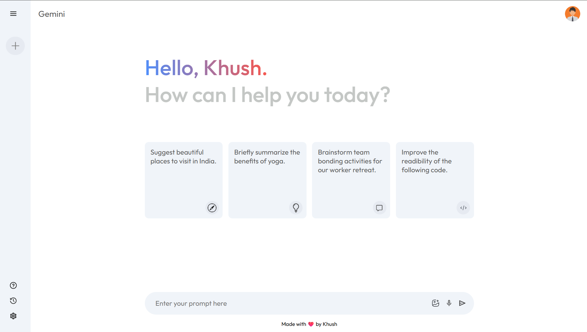

# Gemini Clone 🤖

A modern, responsive AI chatbot inspired by Google Gemini, built using **React, Vite, JavaScript, and the Google Gemini API**.

## 📸 App Preview



## ✨ Features

- 🤖 AI-powered conversations using Google Gemini
- 💬 Interactive chat interface
- ⚡ Fast React + Vite frontend
- 🎨 Gemini-inspired UI
- 📱 Responsive design
- 🔄 Real-time AI responses
- 🧭 Sidebar navigation
- ⌨️ Simple and intuitive prompt input

## 🛠️ Tech Stack

- React.js
- Vite
- JavaScript
- Google Gemini API
- CSS
- npm

## 🚀 Getting Started

### Clone the repository

```bash
git clone https://github.com/YOUR_USERNAME/gemini-clone.git
cd gemini-clone